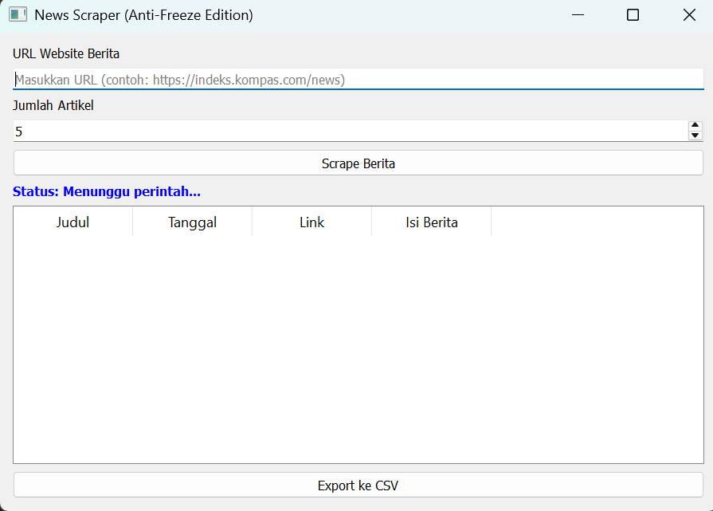
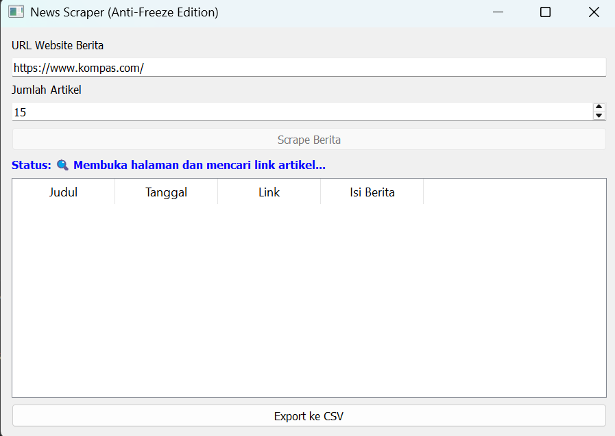
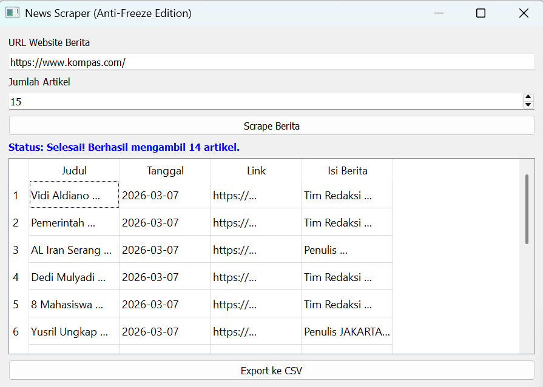
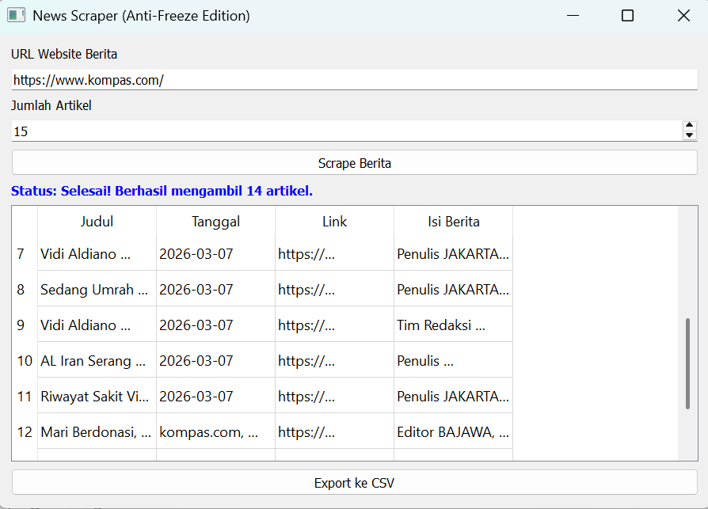
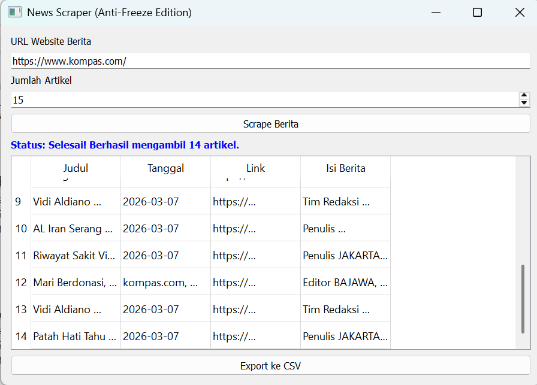
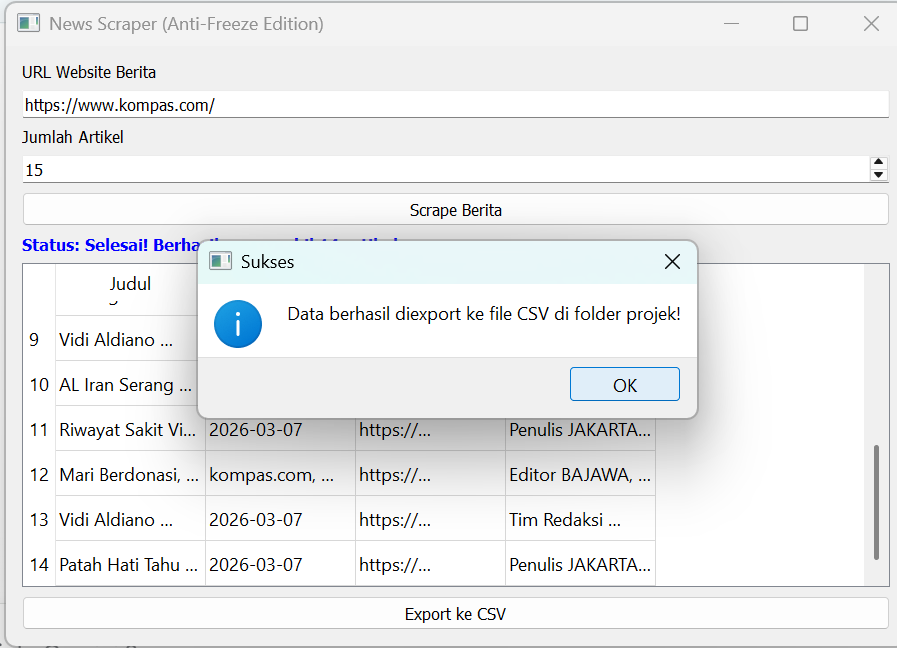
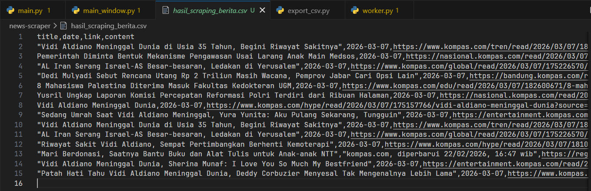

# News Scraper App (Anti-Freeze Edition) by D4 Team

**Deskripsi**: Sebuah aplikasi desktop berbasis GUI untuk melakukan _scraping_ artikel berita secara otomatis dari portal berita raksasa di Indonesia. Dibuat menggunakan Python, PyQt5, dan Selenium.

## Fitur Utama

- **Auto-Scraping Berita :** Mengambil judul, tanggal, link, dan isi konten berita secara otomatis.
- **Smart URL Filter :** Menggunakan Regex (Regular Expression) untuk memastikan mesin hanya mengambil artikel berita asli, dan mengabaikan halaman iklan, video, atau kategori.
- **Anti-Freeze GUI :** Dilengkapi dengan _Background Threading_ (QThread) sehingga antarmuka aplikasi tetap responsif dan tidak _hang_ saat mesin pencari sedang bekerja.
- **Export to CSV :** Menyimpan hasil _scraping_ ke dalam format `.csv` (mendukung `utf-8-sig`) yang siap diolah lebih lanjut.

## Cara Menjalankan Aplikasi

1. Clone repositori ini ke komputer Anda.
2. Buka folder proyek di terminal/Command Prompt.
3. Jalankan perintah berikut:
   ```bash
   "python main.py"
   ```
4. Setelah jendela aplikasi terbuka, masukkan URL indeks berita (contoh:https://www.kompas.com/ atau https://www.detik.com/)
5. Atur jumlah limit artikel yang ingin diambil.
6. Klik tombol "Scrape Berita" dan tunggu hingga proses selesai.
7. Klik tombol "Export ke CSV" untuk menyimpan data ke folder proyek Anda.

## Preview Tampilan

**1. Tampilan Awal Aplikasi**
_(Aplikasi siap digunakan dengan antarmuka 4 kolom)_


**2. Proses Scraping Berjalan (Background Threading)**
_(UI tetap responsif dan menampilkan status real-time saat mesin mengambil data)_


**3. Hasil Scraping Berhasil Ditampilkan**
_(Data judul, tanggal, link, dan isi berita berhasil diekstrak dan masuk ke dalam tabel)_



.png>) //Note: Hanya menampilkan 14 artikel, karena 1 artikel terdeksi cacat

**4. Notifikasi Export Berhasil**
_(Fitur penyimpan data terintegrasi dengan baik dan memberikan feedback ke user)_


**5. Output File CSV (Raw Data)**
_(Data tersimpan dengan aman dalam format utf-8-sig yang siap diolah lebih lanjut)_


## Kontributor

Proyek ini dikerjakan oleh kelompok D4:

1. 251524100 Fidella Rafida Ariani - GUI Designer -- Git contact: @FidellaFafidaAriani
2. 251524107 Zulfi Al Fikri Abdillah - Thread/Background Worker Developer --  Git contact: @zulfi-real
3. 251524114 Muhammad Iqbal - Data Processing & GUI Integrator -- Git contact: @akirandqq
4. 251524115 Muhammad Nafis Idris - Selenium Scraper & URL Logic -- Git contact: @nfishh
5. 251524117 Muhammad Ziddan - Export CSV -- Git contact: @muhammadziddan14
